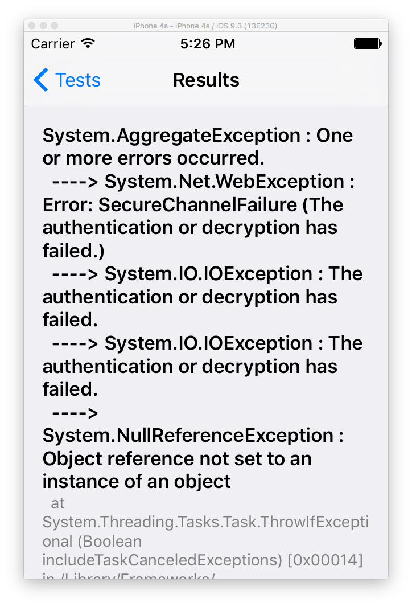
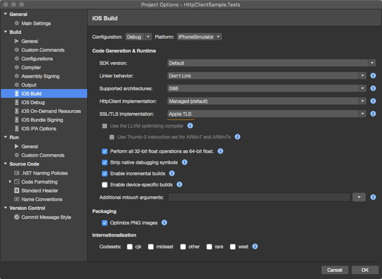

## การใช้งาน HttpClient

## เครื่องที่ใช้ทดสอบ

```
System Version: OS X 10.11.4 (15E65)
Kernel Version: Darwin 15.4.0
Xamarin Studio Community: 6.0 (build 5104)
```

## ในกรณีที่ URL เป็น https

- จะเกิด Error SecureChannelFailure

    

- ให้ปรับ SSL/TLS implementation เป็น Apple TLS

    

```
[Test]
public void ShouldConnectToGoogle() {
    var url = "https://www.google.com";
    var client = new HttpClient ();
    var rs = client.GetAsync (url).Result;
    var status = rs.StatusCode;
    Assert.AreEqual (status, HttpStatusCode.OK);
}
```

```
[Test]
public void ShouldConnectToSoundcloud () {
    var url = "http://api.soundcloud.com/users/67393202/tracks.json?client_id=0be8085a39603d77fbf672a62a7929ea";
    var handler = new HttpClientHandler { };
    var client = new HttpClient (handler);
    var result = client.GetStringAsync (url).Result;
    var obj = JsonConvert.DeserializeObject<List<Dictionary<string,object>>> (result).Select (x => new {
        Title = x["title"],
        Genre = x["genre"]
    });

    var genersis = obj.Where (x => x.Genre.ToString() == "GENESIS").Count ();
    Assert.AreEqual (1, genersis);
    Assert.IsTrue (obj.Count () > 0);
}
```

